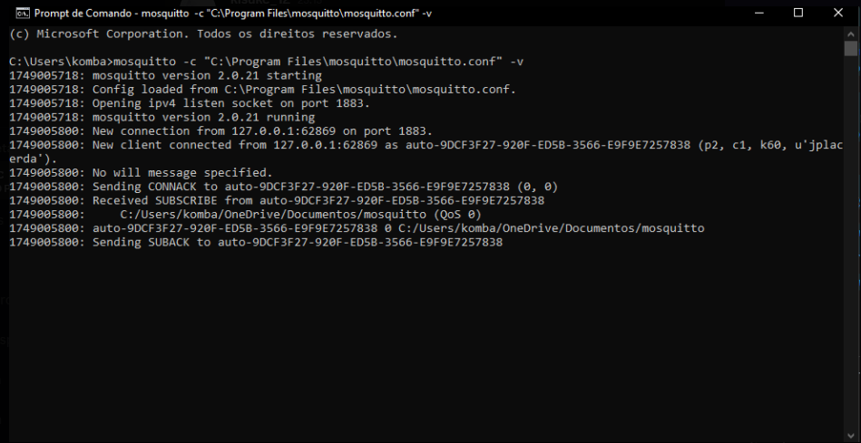
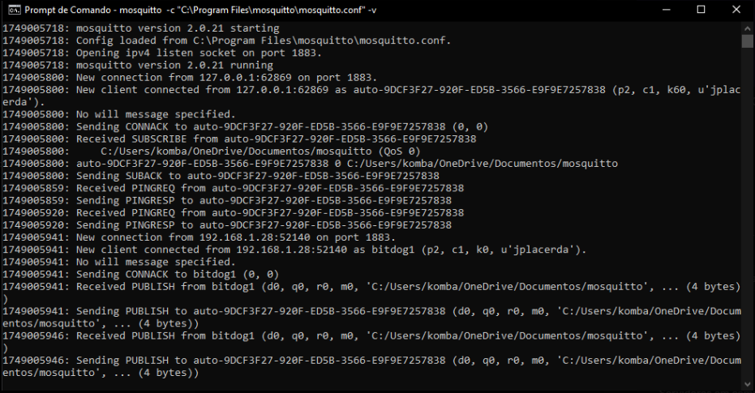
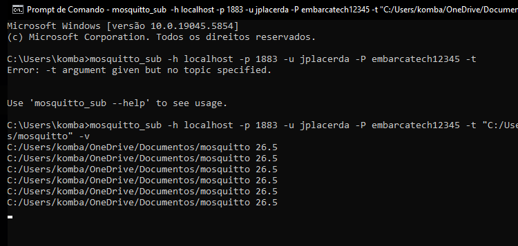
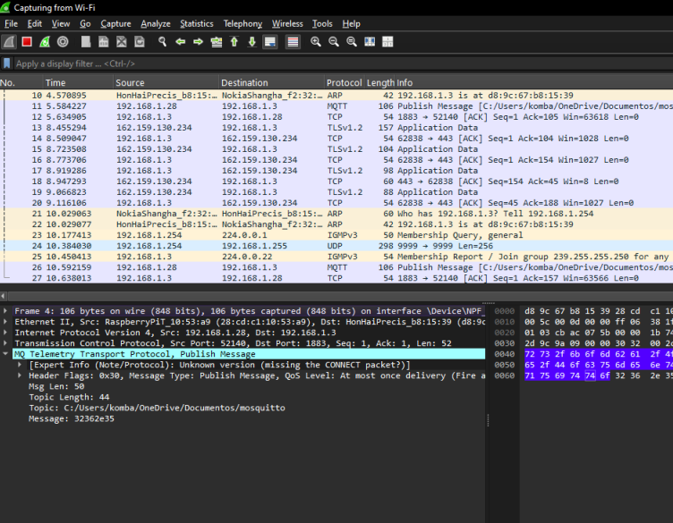

# 🔒 Segurança em IoT com BitDogLab — Relatório de Análise 

## Descrição 
Este projeto demonstra a implementação de segurança em comunicação MQTT utilizando a BitDogLab. Foram aplicadas técnicas de autenticação, criptografia leve e proteção contra ataques de sniffing e replay. 

---

## Etapas e Evidências 

---

### 1. Inicialização do Broker MQTT 

- O broker Mosquitto foi configurado com autenticação na porta `1883`.
- Foi realizada a inicialização do servidor e a conexão bem-sucedida da BitDogLab.

**Conexão:**   

---

### 2. Publicação e Recepção de Mensagens 

- A BitDogLab publicou uma mensagem no tópico MQTT configurado.
- A mensagem foi corretamente recebida pelo subscriber, demonstrando que a comunicação está funcional.

**Publicação e Recepção:**   
 

---

### 3. Subscrição Ativa 

- Foi realizada uma subscrição contínua no tópico.
- A BitDogLab envia dados periodicamente, e o subscriber permanece escutando o tópico.

**Subscrição no Tópico:**   
 

---

### 4. Verificação no Wireshark 

- Captura de pacotes via Wireshark demonstra que as mensagens estão criptografadas (via cifra XOR).
- Conteúdo ofuscado, impossibilitando leitura direta.

**Captura Wireshark (Mensagem Criptografada):**   
 

---

## 🔍 Análise Técnica

### **O que funciona bem:**   
- Autenticação no broker garante acesso restrito.   
- Publicação, recepção e subscrição operam de forma estável.   
- Criptografia leve (XOR) impede leitura direta no tráfego básico. 

###  **Limitações:**   
- XOR é insuficiente para segurança real — apenas ofuscação.   
- MQTT sem TLS é vulnerável em redes abertas. 

### **Escalabilidade:**   
- A solução é viável em ambientes controlados, como laboratórios e redes educacionais.  
- Para ambientes mais críticos, é recomendada a implementação de TLS (MQTTS) e criptografia robusta como AES.

---

## Melhorias Futuras 

- Substituir XOR por **AES** (via mbedTLS ou libs leves em C).   
- Adicionar autenticação por HMAC para garantir integridade.   
- Migrar para **MQTTS** para comunicação segura de ponta a ponta. 

---
